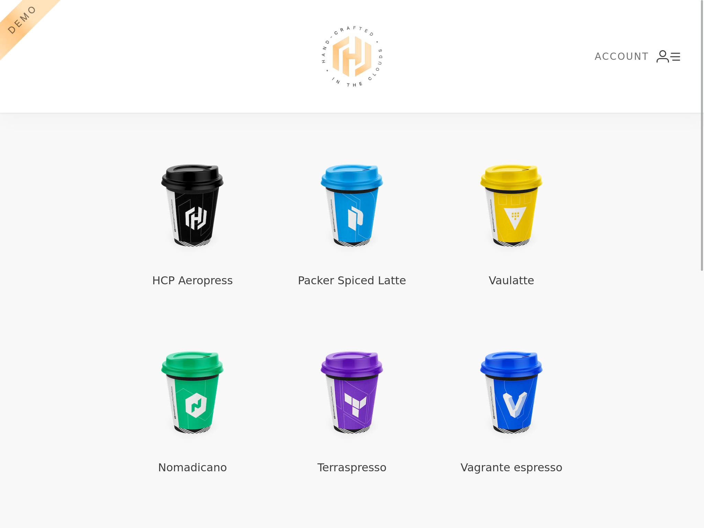
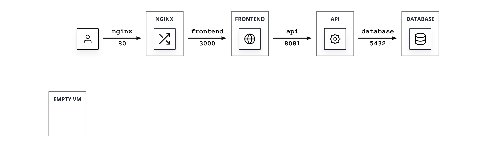

[Home](../README.md)

# HashiCups on VMs

HashiCups is a demo coffee shop application made up of several 
microservices running on VMs.



## Architecture

The services that compose HashiCups run on VMs.

The application is composed by a mix of microservices and monolith services running on four different VMs.

1. `NGINX`: an NGINX server configured as reverse proxy for the application. This is the public facing part of your application.
1. `FRONTEND`: the application frontend.
1. `API`: the application API layer. Is composed by multiple services but all of them are running on the same host, waiting to be migrated into microservices.
1. `DATABASE`: a PostgreSQL instance.



### Service Map

The table shows more details on the services structure.

| Service       | PORT    | Upstream
| ------------- | ------- | ---------------
| database      | 5432    | []
| api           | 8081    | [database]
|   - payments  |   8080  |   []
|   - product   |   9090  |  *[database]
|   - public    |  *8081  |   [api.product, api.payments]
| frontend      | 3000    | [api.public]
| nginx         | 80      | [frontend, api.public]

* `Service`: name of the service. In the environments names are composed using the following naming scheme:
    ```
    hashicups-<service-name>[-<sub-service-name>]
    ```
* `Port`: the port on which the service is running. The *api* meta-service is using multiple ports, one per sub-service. The one marked with a `*` is the only one that requires external access.
* `Upstream`: represent the dependencies each service has. If one of the services mentioned in this column is not working properly, then the service will not work either.


